<style>
/* reduce from default 48px: */
.reveal {
  font-size: 24px;
  text-align: left;
}
.reveal .slides {
  text-align: left;
}
/* change from default gray-on-black: */
.hljs {
  color: #005;
  background: #fff;
}
/* prevent invisible fragments from occupying space: */
.fragment.visible:not(.current-fragment) {
    display: none;
    height:0px;
    line-height: 0px;
    font-size: 0px;
}
/* increase font size in diagrams: */
.label {
    font-size: 24px;
    font-weight: bold;
}
/* increase maximum width of code blocks: */
.reveal pre code {
    max-width: 1000px;
    max-height: 1000px;
}
</style>


# Flexible OCR workflows with OCR-D

Konstantin Baierer, Robert Sachunsky, Kay-Michael Würzner

---

## Contents

- Workspaces
- Processors
- Integration
- Workflow
- Wishlist

---

## Workspaces

- *Physical* representation of a METS file
    - Directory with subdirectories for each file group
    - Each subdirectory contains the listed files
- Adding and removing files explicitly via `ocrd workspace` command
- Adding files implicitly via `ocrd process` command
    - Using the output file group parameter `-O`
- Cloning remote “workspaces” (i.e. METS files)
    - Access to millions of digitized books!

```shell
ocrd workspace clone \
  https://digital.slub-dresden.de/data/kitodo/gottgott_38213401X/gottgott_38213401X_mets.xml .
```

---

## Processors

- Representation of OCR-related operations as *processor*
- Operate within an OCR-D workspace
- Input and output definition via METS file groups
- Parameter specification via JSON
- Invocation via
    - Individual CLI (i.e. `ocrd-anybaseocr-crop`)
    - Meta-processor `ocrd process` (concatenated invocation of multiple processors within a single call)
- Existing workflow-fit processors:
    - Ocropy-based
    - Tesseract-based
    - Olena-based binarization
    - Module Projects

----

### Ocropy-based processors

- Many OCR-related operations available
    - Not cleanly wrapped
    - Not separately available
- Creating processors for
    - Binarization (on page/region/line level)
    - Deskewing (on page/region level)
    - Dewarping (on line level)
    - *Clipping/resegmentation*
- Ultimate goal: Ocropy as an API
    - Code clean-up and improvement
    - Additional operations
    - Restructuring into API and processors

----

### Ocropy-based processors

#### Code clean-up and improvement

- move common Ocropy functions into `common`
  (from CLIs, from `OLD/`), add new ones:
  - `PIL.Image` vs `np.ndarray` conversions: **`array2pil`**, **`pil2array`**
    (integer vs normed float)
  - plausibility checks: **`check_page`**, **`check_region`**, **`check_line`**
    (but mix absolute and relative bounds, and make DPI-zoomable)
  - `nlbin` deskewing: **`estimate_skew_angle`**, **`estimate_skew`**
    (but resize when rotating, with minimum on variance drop)
  - `nlbin` binarization: **`estimate_local_whitelevel`**, **`estimate_thresholds`**, **`binarize`**
    (but keep exact pixel size, catch NaN)
  - remove connected components only contained in the margins: **`borderclean`**

----

### Ocropy-based processors

#### Code clean-up and improvement

- disect and improve segmentation:
  - **`remove_hlines`**: add height threshold, reduce default width threshold
  - **`compute_separators_morph`**: reduce thresholds (because black colseps can be discontinuous), use only connected components fully inside zone
  - **`compute_gradmaps`**: reduce boxmap minsize (for chopped lines at margins), reduce horizontal blur (to avoid joining lines via as-/descenders)
  - **`compute_line_seeds`**: more robust top/bottom projection rules and no horizontal blur (to avoid joining lines via as-/descenders)
  - **`hmerge_line_seeds`**: new way to ensure horizontal label consistency
  - **`compute_segmentation`**:
    - `fullpage` switch (regions do not have hlines and colseps)
    - `zoom` parameter (thresholds must be DPI-relative)
    - use twice the estimated `scale` (blackletter has huge capitals and dense as-/descenders – avoid splitting lines)
    - before spreading line seeds, assign unlabelled connected components to their majority seed (instead of splitting)

----

### Ocropy-based processors

#### New operation: *Resegmentation*

observation 1: 
  ~ Ocropy dewarping and recognition is very sensitive to connected components intruding from neighbouring lines (e.g. ascenders and descenders)

observation 2: 
  ~ GT line segmentation is very coarse (only bounding boxes, large overlap)

idea: 
  ~ use Ocropy line segmentation to improve GT line segmentation via label majority rule, then annotate _shrinked polygon_

...

----

### Ocropy-based processors

#### New operation: *Clipping*

observation 1: 
  ~ on GT, both regions and lines often overlap with their neighbouring regions and lines – not just in the background, but within connected components

idea 1: 
  ~ remove connected components that are not fully contained in the segment but in a neighbour

observation 2: 
  ~ many frequent cases of this will create interior islands or non-contiguous polygons (not allowed in PAGE-XML, usually not supported by implementations)

idea 2: 
  ~ do not remove by shrinking the polygon, but by _clipping_ to the background colour

...

note:
- can be used to suppress graphics or separators within or across a region or line
- can be used as an alternative to resegmentation (on the line level)
- can not be applied if the segment already has `AlternativeImage` or `@orientation` (segments and neighbours become incomensurable)
- runs best after binarization

----


----

### Ocropy-based processors

#### Ocrolib is under way!

Planned restructuring:

- `tmbdev/ocropy`, forked under `OCR-D/ocropy`:
  - move non-UI functions from CLIs into `ocrolib`
  - package `ocrolib` under PyPI _ocrolib_
  - package CLIs under PyPI _ocropus_
  - add our `ocrolib` changes (one by one):
    - Python 3 port
    - additional `ocrolib.common` functions
    - improvements in segmentation
  - try to get upstream approval
- our `OCR-D/ocrd_ocropus`:
  - only for OCR-D wrappers
  - base on new `ocrolib`


----

### Tesseract-based processors

- Many OCR-related operations available
    - Mostly available via API
    - Exposed to Python via `tesserocr`
- Creating Processors for
    - Binarization (on region/line level)
    - Cropping
    - Deskewing (on page/region level)
    - Segmentation (on page/region/line level)
    - Text recognition
- Often more robust segmentation and text recognition than Ocropy

----

### Tesseract-based processors

#### New processor: Poor-man's cropping

- Cropping not implemented as separate function in Tesseract
- Idea: minmal rectangle around all detected regions as `Border`
- Side effect: Quality improvement through repeated region localization within `Border`
- Problems:
    - Facing pages
    - Empty or sparsely filled pages
    - Robustness (i.e. works good for most but really bad for some pages)

----

### Tesseract-based processors

#### Basal segment classification

- Distinction of different region types in Tesseract
    - Text
    - Image
    - Separator
    - Table
    - ...
- Classification exposed to `ocrd_tesserocr_segment_region`

----

### Tesseract-based processors

#### Basal segment classification


----

### Olena-based binarization

- Binarization is still relevant!
    - No rgb-processing recognition engine(s) available
    - High influence on OLR and OCR results
- Multiple binarization implementations in Olena
    - *Kim*, *Niblack*, *Wolf* ...
    - Only as CLIs
- `Bashlib` as last resort
- Only on page level, but with `AlternativeImage` (as case study in _xmlstarlet_)

----

### Olena-based binarization

> [name: wrznr] @bertsky adds two different binarized versions of the same page

----

### Module Project-based processors

- Not very many workflow-fit
    - Interface compatibility
    - Result delivery
- Insufficient documentation
    - Short `README`s
    - Missing integration examples
    - Missing training facilities
- Low visibility

----

### Module Project-based processors

#### `ocrd-anybaseocr-crop`

- Interface-compatible page border detection
    - Collaborated effort between module project and coordination project
    - Extremely important preprocessing step (due to DFG requirements on digitization)
    - Not yet implemented for other `anybaseocr`-based processors
- Very, very promising results
- Input: image
- Output: `Border` element with coordinates
- Not yet `AlternativeImage`-sensitive

----

### Module Project-based processors

#### `ocrd-anybaseocr-crop`: example

| Tesseract                          | DFKI                               |
:-----------------------------------:|:-----------------------------------:
 | 

---

## Integration

- APIs for PAGE and METS
    - Delivery of results in a comfortable and interoperable way
    - No need to directly modify XML files
- Use PAGE for
    - Page-level, region-level, line-level, word-level and glyph-level results
    - `AlternativeImage` as a construct for results which can not be *directly* described
- Use METS for
    - Document-level results
- Specific aspects:
    - DPI impact
    - Description vs. image  
      (`AlternativeImage`)
    - Multiple inputs or outputs
    - Logging as a result

----

### DPI impact

- most OLR and OCR operations are sensitive to

----

### Description vs. image

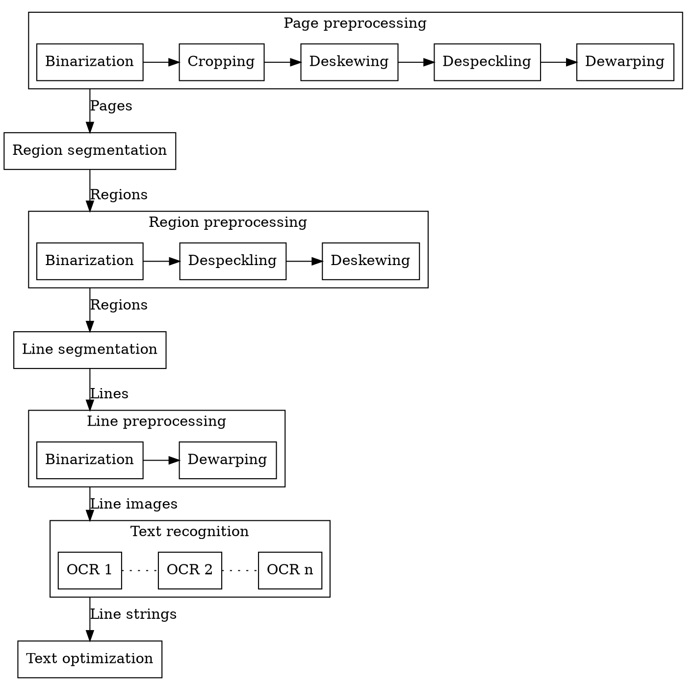

----

### Description vs. image

- PAGE: hierarchy of elements, _each_ with descriptive and binary content
  - **original** `/PcGts/Page/@imageFilename`
  - **derived** `//AlternativeImage/@filename`
- preprocessing steps: 2 cases:
  1. producing derived images _obligatory_:  
     binarization, despeckling, dewarping
  2. just describing the operation (images _optional_):  
     cropping/segmentation (`Coords/@points`), deskewing (`@orientation`)
     
     operation must be _applied_ at some point – preferably when descending to a lower hierarchy level (i.e. during segmentation)
- consumers: must always
  - _respect_ `AlternativeImage` if present on their hierarchy level of interest
  - _generate_ an image from the parent (which again could have `AlternativeImage`) otherwise – by:
    - **cutting** from `Coords/@points`
    - **rotating** by `(Page|TextRegion)/@orientation`


----

### Description vs. image

#### AlternativeImage problems and solutions

- bounding box rectangles are too coarse (esp. in the presence of skew)  
  → **polygon** coordinates must always be preserved fully (using polygon masking instead of simple cutting)
- **coordinates are absolute** (they reference the _original_ image)  
  → before cutting from the parent image, coordinates must be converted _to relative_  
  → before adding new child elements, coordinates must be converted _from relative_  
  → offsets must always be passed down the hierarchy
- not all image operations retain pixel positions:
  1. deskewing → annotate `@orientation`, _but_:
     - rotation generally increases the binary image at the margins  
       → compensate by **additional offset** (half the increase in size)
     - rotation applies around the center of the image, not the origin  
       → coordinates must be **translated to center**, rotated passive, then translated back
  2. dewarping → use `Grid`?
  3. rescaling → extend PAGE-XML with `@scale`?

----

### Description vs. image

#### summary

(slightly more abstract)
 - coordinates must be **reproducible**:  
   > Annotation must be sufficient to calculate pixel positions in `AlternativeImage` from those in `@imageFilename`
   > (e.g. to cut parents) or vice versa (e.g. to add children).
 - image preprocessing steps which alter the coordinate system must describe their transform appropriately:
   - linear coordinate transformations (translation/offset, rotation/angle, scale) can be made exact (up to rounding)
   - non-linear transformations (dewarping) are inexact ...

----

### Description vs. image

#### remaining issues

- strictness of `AlternativeImage@comments` classification:
  - multiple `AlternativeImage` entries  
    → rely on `@comments`, or always append/choose last?
  - if `AlternativeImage` _and_ `@orientation`  
    → rely on `@comments`, or expect the image to be deskewed already?
  - if `AlternativeImage` _and_ `Border`  
    → rely on `@comments`, or expect the image to be cropped already?
- reproducibility:
  - if `AlternativeImage` is larger than `Coords/@points` rectangle  
    → due to rotation (offset) or rescaling (zoom) or both!  
    → introduce `@scale` or prohibit rescaling altogether?
  - (page/line-level) dewarping  
    → use `Grid`?

----

### Description vs. image

#### implementation in `OCR-D/core`

##### high-level API:

- image/offset recursion:
  - **`Workspace.image_from_page`**: on the page level (original or derived)
  - **`Workspace.image_from_segment`**: all levels below page (derived)
  <div>
  
  what it does:
  - get last `AlternativeImage` or generate from parent (including:
    - conversion of coordinates to parent-relative, which involves offset correction and possibly coordinate rotation,
    - possibly image rotation)
  - return the image and its absolute bounding box (compensating for resizing by additional offset)
  - (`image_from_page` only:) also return `OcrdExif` instance for original
  </div>
  <!-- .element: class="fragment fade-in-then-fade-out" data-fragment-index="1" -->
  <div>
  
  how to use:
  - not recursive itself – needs to be called recursively, passing down results:
   ```python
   from ocrd_modelfactory import page_from_file
   ...
       page_id = input_file.pageId or input_file.ID # for logging
       pcgts = page_from_file(workspace.download_file(input_file))
       page = pcgts.get_Page()
       page_image, page_xywh, page_image_info = workspace.image_from_page(
           page, page_id)
       ...
       for region in page.get_TextRegion():
           region_image, region_xywh = workspace.image_from_segment(
               region, page_image, page_xywh)
           ...
           for line in region.get_TextLine():
               line_image, line_xywh = workspace.image_from_segment(
               line, region_image, region_xywh)
               ...
   ```
   </div>
   <!-- .element: class="fragment" data-fragment-index="2" -->

----

### Description vs. image

#### implementation in `OCR-D/core`

##### high-level API:

- add image to METS:  
  **`Workspace.save_image_file`**
  <div>
  
  what it does:
  - export image file from `PIL.Image` object
  - make file path from fileGrp, ID and format
  - reference the file in METS via `Workspace.add_file`
  - return file path
  </div>
  <!-- .element: class="fragment fade-in-then-fade-out" data-fragment-index="1" -->
  <div>
  
  how to use:
  - needs to know image fileGrp, unique ID:
   ```python
   ...
   file_id = input_file.ID.replace(self.input_file_grp, 
       'OCR-D-IMG-DEWARP')
       ...
           file_path = workspace.save_image_file(image, 
               file_id + '_' + region.id + '_' + line.id,
               page_id=input_file.pageId,
               file_grp='OCR-D-IMG-DEWARP')
           line.add_AlternativeImage(AlternativeImageType(
               filename=file_path, 
               comments=comments + ',' + 'dewarped')
   ```
   </div>
   <!-- .element: class="fragment" data-fragment-index="2" -->

----

### Description vs. image

#### implementation in `OCR-D/core`

##### low-level API:

- convert from absolute coordinates to relative:
  **`ocrd_utils.coordinates_of_segment`**
  
  what it does:
  - get the points of the element's polygon outline
  - shift all points by the offset (top-left corner) of the parent towards origin
  - (in case the parent was rotated:) rotate all points with the center of the image as pivot
  
  how to use:
   ```python
   line_polygon = coordinates_of_segment(line, region_image, region_xywh)
   line_polygon = resegment(line_polygon, region_labels, region_image_bin, line.id)
   line_polygon = coordinates_for_segment(line_polygon, region_image, region_xywh)
   line.get_Coords().points = points_from_polygon(line_polygon)
   ```

----

### Description vs. image

#### implementation in `OCR-D/core`

##### low-level API:

- convert from relative coordinates to absolute:
  **`ocrd_utils.coordinates_for_segment`**
  
  what it does:
  - (in case the parent was rotated:) rotate all points with the center of the image as pivot in opposite direction
  - shift all points by the offset (top-left corner) of the parent away from origin
  
  how to use:
   ```python
   ...
   for word_no, word in enumerate(iterate_level(tessapi.GetIterator(), RIL.WORD)):
       word_id = '%s_word%04d' % (line.id, word_no)
       bbox = word.BoundingBox(RIL.WORD)
       points = points_from_polygon(coordinates_for_segment(
           polygon_from_x0y0x1y1(bbox),
           None, # image not needed if element cannot have angle
          line_xywh))
       word = WordType(id=word_id, Coords=CoordsType(points))
       line.add_Word(word)
   
   ```

----

### Description vs. image

#### implementation in `OCR-D/core`

##### low-level API:

- only coordinate rotation (as `numpy.ndarray`):
  **`ocrd_utils.rotate_coordinates`**
- mask away exterior to background:
  **`image_from_polygon`**
- background-agnostic replacement for `PIL.Image.crop`:
  **`ocrd_utils.crop_image`**
- ...

----

### Description vs. image

#### early adopters

- core Python implementation is already used by:
  - [Tesseract processors](https://github.com/OCR-D/ocrd_tesserocr)
  - [Ocropy processors](https://github.com/cisocrgroup/cis-ocrd-py/)
- core Bash implementation WIP used by:
  - [Olena binarization](https://github.com/OCR-D/ocrd_olena)

----

### Multiple inputs or outputs

- specified with [comma-separated list](https://ocr-d.github.io/cli#command-line-interface-cli) on CLI:
  
  ```bash
  $ ocrd-olena-binarize -I OCR-D-GT-SEG-LINE -O OCR-D-SEG-PAGE,OCR-D-IMG-BIN
  $ ocrd-cor-asv-ann-evaluate -I OCR-D-GT-SEG-LINE,OCR-D-OCR-TESS,OCR-D-COR-ASV-ANN
  ```

----

### Multiple inputs or outputs

#### use-case for multi-valued input: alignment

- `TextLine/TextEquiv/Unicode` alignment via
  - global sequence alignment
    (see [ocrd-cis-align](https://github.com/cisocrgroup/cis-ocrd-py/blob/51702097e0e4ea023a06d131769eaa0de81dcdd4/ocrd_cis/align/aligner.py#L26) or [ocrd-cor-asv-ann-evaluate](https://github.com/ASVLeipzig/cor-asv-ann/blob/a460bd5a95bd6fa092c40259f99355c3af02f01b/ocrd_cor_asv_ann/wrapper/evaluate.py#L51))
  - neural attention mechanism
    (cf. Dong&Smith 2018 _Multi-input attention_)
- resegmentation
- possibly: text alignment informed by segmentation (coordinates)

----

### Multiple inputs or outputs

#### use-case for multi-valued output: PAGE and image

- image preprocessing produces PAGE with `AlternativeImage` references
  → generated images must also be added to METS
- bad solution: 
  fixed fileGrp `OCR-D-IMG-BIN`, `OCR-D-IMG-DESKEW`, `OCR-D-IMG-DEWARP` etc.
- good approach: 
  - use `output_file_grp` second position, 
  - fallback to default if not given
    (e.g. [ocrd-tesserocr-binarize](https://github.com/OCR-D/ocrd_tesserocr/blob/ca2530d0f4ffd23ca5bfe7380f1b1089af36f6b6/ocrd_tesserocr/binarize.py#L59) or ocrd-olena-binarize)

----

### Logging as a result

- not all operations have a naturaly (PAGE/image) output file group: e.g. OLR/OCR evaluation, model training
- some need to aggregate over multiple pages (or even workspaces): e.g. CER/WER


---

## Workflow

### Running

- with individual CLIs combined in a custom bash script:
- with `ocrd process` as engine:
- with Taverna?
- with Kitodo?
- Baukastenprinzip!!!

----

### Configurations


> [name=Kay-Michael Würzner] Workflow diagram matched to https://github.com/cisocrgroup/cis-ocrd-py#workflow-configuration should live here


----

### Configurations

> [name=Kay-Michael Würzner] Add a table listing the available processors per process step


----

### Measurements on current GT

- Tesseract vs. Ocropy OCR, different models
- Tesseract vs. Ocropy{nlbin} vs. Olena{Kim/Wolf/Sauvola} binarization
- binarization on page level vs. region level
- impact of various preprocessors (deskewing, dewarping, clipping, resegmentation)
- resegmentation vs. clipping on line level
- segmentation accuracy of GT itself
- deskewing on page level vs. region level
- _dewarping on page level vs. line level_ (not covered here)

----


| OCR | CER[%] |
| --- | ------ |
| OCRO{fraktur} | 23.7 |
| OCRO{fraktur(jze)} | 28.4 |
| TESS{Fraktur} | 12.2 |
| TESS{frk} | 11.9 |
| TESS{frk+deu} | 11.5 |

→ layout/preprocessing still not good enough

→ Ocropy suffers from _Frakturwechsel_ (nearly no coverage of Antiqua/Arabic numerals, no way to mix models)

----


| OCR | CER[%] | comparison |
| --- | ------ | ---------- |
| OCRO{fraktur} | 23.2 | (-0.5 for s/tesserocr/ocropy/) |
| OCRO{fraktur(jze)} | 28.0 | (-0.4 for s/tesserocr/ocropy/) |
| TESS{Fraktur} | 12.1 | (-0.1 for s/tesserocr/ocropy/) |
| TESS{frk} | 11.9 | (+-0  for s/tesserocr/ocropy/) |
| TESS{frk+deu} | 11.4 | (-0.1 for s/tesserocr/ocropy/) |

→ Ocropy deskews slightly better than Tesseract (the latter being more conservative)

----

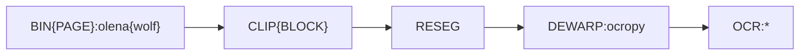

| OCR | CER[%] | comparison |
| --- | ------ | ---------- |
| OCRO{fraktur} | 24.4 | (+1.2 for s//-DESKEW/) |
| OCRO{fraktur(jze)} | 29.3 | (+1.3 for s//-DESKEW/) |
| TESS{Fraktur} | 12.8 | (+0.7 for s//-DESKEW/) |
| TESS{frk} | 12.6 | (+0.7 for s//-DESKEW/) |
| TESS{frk+deu} | 12.2 | (+0.8 for s//-DESKEW/) |

→ Deskewing helps, but not that much (i.e. either GT images already have little skew, or dewarping can compensate)

----

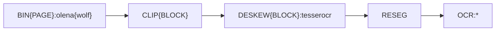

| OCR | CER[%] | comparison |
| --- | ------ | ---------- |
| OCRO{fraktur} | 52.6 | (+28.2 for s//-DEWARP/) |
| OCRO{fraktur(jze)} | 61.4 | (+32.1 for s//-DEWARP/) |
| TESS{Fraktur} | 13.3 | (+ 0.5 for s//-DEWARP/) |
| TESS{frk} | 13.2 | (+ 0.6 for s//-DEWARP/) |
| TESS{frk+deu} | 12.8 | (+ 0.6 for s//-DEWARP/) |

→ Ocropy is very sensitive against warped images, Tesseract nearly immune

----

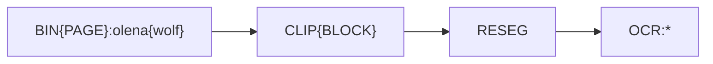

| OCR | CER[%] | comparison |
| --- | ------ | ---------- |
| OCRO{fraktur} | 53.2 | (+0.6 for s/-DEWARP/-DEWARP-DESKEW/) |
| OCRO{fraktur(jze)} | 63.0 | (+1.6 for s/-DEWARP/-DEWARP-DESKEW/) |
| TESS{Fraktur} | 13.5 | (+0.2 for s/-DEWARP/-DEWARP-DESKEW/) |
| TESS{frk} | 13.3 | (+0.1 for s/-DEWARP/-DEWARP-DESKEW/) |
| TESS{frk+deu} | 12.9 | (+0.1 for s/-DEWARP/-DEWARP-DESKEW/) |

→ Deskewing appearently cannot replace dewarping, i.e. either deskewing is too bad, or dewarping cannot compensate missing deskewing in the first place.

----

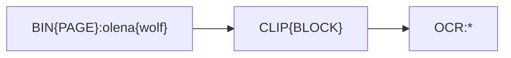

| OCR | CER[%] | comparison |
| --- | ------ | ---------- |
| OCRO{fraktur} | 56.8 | (+3.6 for s/-DEWARP-DESKEW/-DEWARP-DESKEW-RESEG/) |
| OCRO{fraktur(jze)} | 66.0 | (+3.0 for s/-DEWARP-DESKEW/-DEWARP-DESKEW-RESEG/) |
| TESS{Fraktur} | 13.6 | (+0.1 for s/-DEWARP-DESKEW/-DEWARP-DESKEW-RESEG/) |
| TESS{frk} | 13.7 | (+0.4 for s/-DEWARP-DESKEW/-DEWARP-DESKEW-RESEG/) |
| TESS{frk+deu} | 13.3 | (+0.4 for s/-DEWARP-DESKEW/-DEWARP-DESKEW-RESEG/) |

→ Resegmentation primarily helps Ocropy, i.e. Tesseract is much less sensitive to invading as-/descenders from neighbouring lines

----

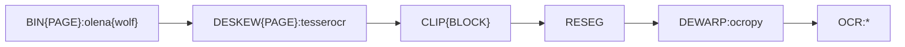

| OCR | CER[%] | comparison |
| --- | ------ | ---------- |
| OCRO{fraktur} | 24.6 | (+0.9 for s/DESKEW{BLOCK}/DESKEW{PAGE}/) |
| OCRO{fraktur(jze)} | 29.7 | (+1.3 for s/DESKEW{BLOCK}/DESKEW{PAGE}/) |
| TESS{Fraktur} | 13.4 | (+1.2 for s/DESKEW{BLOCK}/DESKEW{PAGE}/) |
| TESS{frk} | 13.2 | (+2.2 for s/DESKEW{BLOCK}/DESKEW{PAGE}/) |
| TESS{frk+deu} | 12.7 | (+1.2 for s/DESKEW{BLOCK}/DESKEW{PAGE}/) |

----


| OCR | CER[%] | comparison |
| --- | ------ | ---------- |
| OCRO{fraktur} | 24.2 | (+1.0 for s/DESKEW{BLOCK}/DESKEW{PAGE}/) |
| OCRO{fraktur(jze)} | 29.2 | (+1.2 for s/DESKEW{BLOCK}/DESKEW{PAGE}/) |
| TESS{Fraktur} | 13.0 | (+0.9 for s/DESKEW{BLOCK}/DESKEW{PAGE}/) |
| TESS{frk} | 13.0 | (+1.1 for s/DESKEW{BLOCK}/DESKEW{PAGE}/) |
| TESS{frk+deu} | 12.6 | (+1.2 for s/DESKEW{BLOCK}/DESKEW{PAGE}/) |

→ Deskewing (on average) works slightly better on the region level than on the page level

----

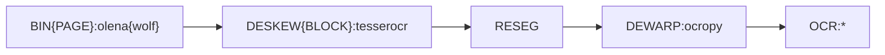

| OCR | CER[%] | comparison |
| --- | ------ | ---------- |
| OCRO{fraktur} | 23.9 | (+0.2 for s//-CLIP{BLOCK}/) |
| OCRO{fraktur(jze)} | 28.6 | (+0.2 for s//-CLIP{BLOCK}/) |
| TESS{Fraktur} | 12.3 | (+0.1 for s//-CLIP{BLOCK}/) |
| TESS{frk} | 12.3 | (+0.4 for s//-CLIP{BLOCK}/) |
| TESS{frk+deu} | 11.9 | (+0.4 for s//-CLIP{BLOCK}/) |

→ Clipping on the region level gives very minimal improvement (if resegmentation is used)

----

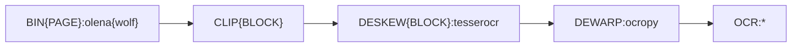

| OCR | CER[%] | comparison |
| --- | ------ | ---------- |
| OCRO{fraktur} | 31.2 | (+7.5 for s//-RESEG/) |
| OCRO{fraktur(jze)} | 35.1 | (+6.7 for s//-RESEG/) |
| TESS{Fraktur} | 13.2 | (+1.0 for s//-RESEG/) |
| TESS{frk} | 12.7 | (+0.8 for s//-RESEG/) |
| TESS{frk+deu} | 12.4 | (+0.9 for s//-RESEG/) |

→ Resegmentation primarily helps Ocropy, i.e. Tesseract is much less sensitive to invading as-/descenders from neighbouring lines

→ Resegmentation needs deskewing

----

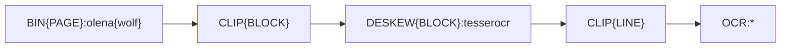

| OCR | CER[%] | comparison |
| --- | ------ | ---------- |
| OCRO{fraktur} | 24.1 | (+0.4 for s/RESEG/CLIP{LINE}/) |
| OCRO{fraktur(jze)} | 28.9 | (+0.5 for s/RESEG/CLIP{LINE}/) |
| TESS{Fraktur} | 12.9 | (+0.7 for s/RESEG/CLIP{LINE}/) |
| TESS{frk} | 12.7 | (+0.8 for s/RESEG/CLIP{LINE}/) |
| TESS{frk+deu} | 12.4 | (+0.9 for s/RESEG/CLIP{LINE}/) |

→ Clipping on the line level cannot quite replace resegmentation, with Tesseract it does not help at all

----


| OCR | CER[%] | comparison |
| --- | ------ | ---------- |
| OCRO{fraktur} | 24.9 | (+1.2 for s/wolf/kim/) |
| OCRO{fraktur(jze)} | 29.6 | (+1.2 for s/wolf/kim/) |
| TESS{Fraktur} | 14.0 | (+1.8 for s/wolf/kim/) |
| TESS{frk} | 14.2 | (+2.3 for s/wolf/kim/) |
| TESS{frk+deu} | 13.8 | (+2.3 for s/wolf/kim/) |

→ Kim is noticeably worse than Wolf (on average)

----

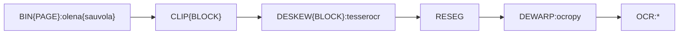

| OCR | CER[%] | comparison |
| --- | ------ | ---------- |
| OCRO{fraktur} | 23.0 | (-0.7 for s/wolf/sauvola/) |
| OCRO{fraktur(jze)} | 27.9 | (-0.5 for s/wolf/sauvola/) |
| TESS{Fraktur} | 12.0 | (-0.2 for s/wolf/sauvola/) |
| TESS{frk} | 11.8 | (-0.1 for s/wolf/sauvola/) |
| TESS{frk+deu} | 11.5 | (+-0  for s/wolf/sauvola/) |

→ Basic Sauvola is slightly better than Wolf (on average)

----


| OCR | CER[%] | comparison |
| --- | ------ | ---------- |
| OCRO{fraktur} | 22.8 | (-0.9 for s/wolf/sauvola-ms-split/) |
| OCRO{fraktur(jze)} | 27.6 | (-0.8 for s/wolf/sauvola-ms-split/) |
| TESS{Fraktur} | 11.6 | (-0.6 for s/wolf/sauvola-ms-split/) |
| TESS{frk} | 11.5 | (-0.4 for s/wolf/sauvola-ms-split/) |
| TESS{frk+deu} | 11.1 | (-0.4 for s/wolf/sauvola-ms-split/) |

→ This Sauvola variant is even better (on average)

----


| OCR | CER[%] | comparison |
| --- | ------ | ---------- |
| OCRO{fraktur} | 36.4 | (+12.7 for s/wolf/ocropy/) |
| OCRO{fraktur(jze)} | 41.1 | (+12.7 for s/wolf/ocropy/) |
| TESS{Fraktur} | 15.7 | (+ 3.5 for s/wolf/ocropy/) |
| TESS{frk} | 14.9 | (+ 3.0 for s/wolf/ocropy/) |
| TESS{frk+deu} | 14.8 | (+ 3.3 for s/wolf/ocropy/) |

→ Ocropy{nlbin} is really bad! (but what about `perc` / `range` / `threshold` / `lo` / `hi` parameters?)

----


| OCR | CER[%] | comparison |
| --- | ------ | ---------- |
| OCRO{fraktur} | 23.0 | (-13.4 for s/BIN{PAGE}/BIN{BLOCK}/) |
| OCRO{fraktur(jze)} | 27.4 | (-13.7 for s/BIN{PAGE}/BIN{BLOCK}/) |
| TESS{Fraktur} | 11.5 | (- 4.2 for s/BIN{PAGE}/BIN{BLOCK}/) |
| TESS{frk} | 11.4 | (- 3.5 for s/BIN{PAGE}/BIN{BLOCK}/) |
| TESS{frk+deu} | 11.2 | (- 3.6 for s/BIN{PAGE}/BIN{BLOCK}/) |

→ Binarization on the region level is superior to the page level (if using Ocropy{nlbin}!)

note:
- clipping is neutral here – it does ad-hoc binarization (with Ocropy{nlbin})
- to be conclusive, the Olena variants should be run like this as well (which requires bashlib access to `AlternativeImage` on the region level)

----


| OCR | CER[%] | comparison |
| --- | ------ | ---------- |
| OCRO{fraktur} | 55.8 | (+32.8 for s/ocropy{nlbin}/tesserocr/) |
| OCRO{fraktur(jze)} | 63.5 | (+36.1 for s/ocropy{nlbin}/tesserocr/) |
| TESS{Fraktur} | 15.0 | (+ 3.5 for s/ocropy{nlbin}/tesserocr/) |
| TESS{frk} | 15.3 | (+ 3.9 for s/ocropy{nlbin}/tesserocr/) |
| TESS{frk+deu} | 14.8 | (+ 3.6 for s/ocropy{nlbin}/tesserocr/) |

→ Ocropy cannot cope with Tesseract binarization.

→ But even Tesseract prefers Ocropy binarization!

note:
- to be conclusive, Tesseract binarization should be run on the page level for comparison, but this is impossible with its CAPI

----

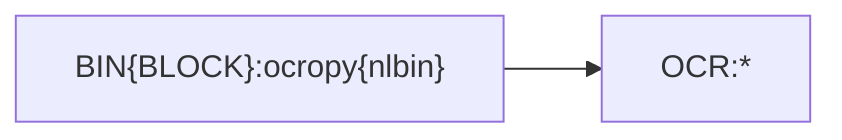

| OCR | CER[%] | comparison |
| --- | ------ | ---------- |
| OCRO{fraktur} | 55.4 | (+32.4 for s//-CLIP-DESKEW-RESEG-DEWARP/)^1^ |
| OCRO{fraktur(jze)} | 64.6 | (+37.2 for s//-CLIP-DESKEW-RESEG-DEWARP/)^1^ |
| TESS{Fraktur} | 12.9 | (+ 1.4 for s//-CLIP-DESKEW-RESEG-DEWARP/) |
| TESS{frk} | 12.9 | (+ 1.5 for s//-CLIP-DESKEW-RESEG-DEWARP/) |
| TESS{frk+deu} | 12.7 | (+ 1.5 for s//-CLIP-DESKEW-RESEG-DEWARP/) |

→ Without the extra preprocessors, Ocropy is lost on GT.

^1^: "naîve" configuration of Ocropy

----

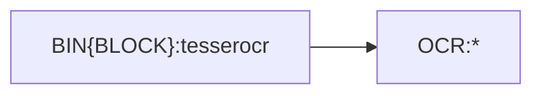

| OCR | CER[%] | comparison |
| --- | ------ | ---------- |
| OCRO{fraktur} | 66.4 | (+10.4 for s//-CLIP-DESKEW-RESEG-DEWARP/) |
| OCRO{fraktur(jze)} | 72.4 | (+ 8.9 for s//-CLIP-DESKEW-RESEG-DEWARP/) |
| TESS{Fraktur} | 16.2 | (+ 1.2 for s//-CLIP-DESKEW-RESEG-DEWARP/)^2^ |
| TESS{frk} | 16.9 | (+ 1.6 for s//-CLIP-DESKEW-RESEG-DEWARP/)^2^ |
| TESS{frk+deu} | 16.4 | (+ 1.6 for s//-CLIP-DESKEW-RESEG-DEWARP/)^2^ |

→ Without the extra processors, Tesseract still works.

^2^: "naîve" configuration of Tesseract (but how does this compare to the CLI?)

----

```mermaid
graph LR
bin["BIN{PAGE}:olena{wolf}"]
bin --> ocr
ocr[OCR:*]
```

| OCR | CER[%] | comparison |
| --- | ------ | ---------- |
| OCRO{fraktur} | 56.8 | (+33.1 for s//-CLIP-DESKEW-RESEG-DEWARP/) |
| OCRO{fraktur(jze)} | 66.0 | (+37.6 for s//-CLIP-DESKEW-RESEG-DEWARP/) |
| TESS{Fraktur} | 13.6 | (+ 1.4 for s//-CLIP-DESKEW-RESEG-DEWARP/) |
| TESS{frk} | 13.5 | (+ 1.6 for s//-CLIP-DESKEW-RESEG-DEWARP/) |
| TESS{frk+deu} | 13.3 | (+ 1.8 for s//-CLIP-DESKEW-RESEG-DEWARP/) |

→ Again, Ocropy requires the extra preprocessors, while Tesseract is suprisingly insensitive to invading neighbouring regions/lines, against skewed and warped images.

----

### Striving for best-practice configurations

- Increasing number of processors
    - DFKI preprocessing and layout analysis
    - Würzburg layout analysis
    - Leipzig and Munich post correction
- Increasing number of models
    - Trainable processors?
    - Erlangen font detection + Leipzig training tools
    - OCR-D GT
- Increasing number of possible configurations
    - Recommendations for users are needed!
    - (Tools and workflows for text-based evaluation)
    - Tools and workflows for layout evaluation

---

## Wishlist

- [ ] improve quality/consistency of existing processors  
  (`AlternativeImage`, DPI, packaging, logging, documentation)
- [ ] OCR-D wrapper for PRImA Layout Evaluation (profiles)
- [ ] OCR-D wrapper for ScanTailor
- [ ] OCR-D wrapper for [page-level dewarping with Leptonica](https://tpgit.github.io/UnOfficialLeptDocs/leptonica/dewarping.html)

